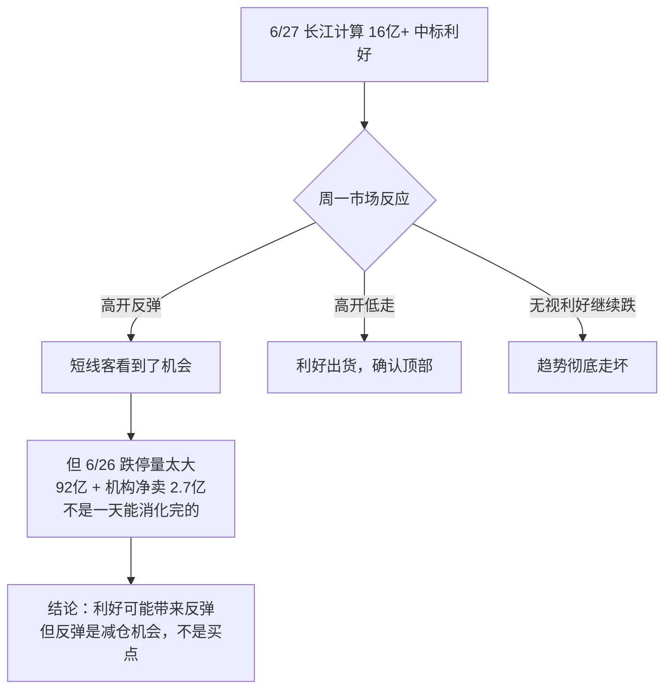

# 短线分析：烽火通信 (600498)

> 📅 分析日期：2026-06-28（周日，盘前）
> 🎯 分析视角：纯短线博弈（技术面 + 资金面 + 情绪面 + 催化剂）
> 📊 上周五收盘：76.22 元（跌停 -10.00%）
> ⚠️ 重要新信息：6/27 长江计算中标中国电信 16 亿+ 服务器大单

---

## 一、近期走势全景：半年 +135%，高位首次跌停

### 1.1 关键价格里程碑

| 日期 | 价格 | 事件 |
|------|:----:|------|
| 2026-01-02 | ~32 元 | 年初起点 |
| 2026-06-25 | **84.69 元** | **半年最高点** |
| 2026-06-26 | **76.22 元** | **跌停 -10%** |
| 累计涨幅 | **+135%** | 仅 6 个月 |

### 1.2 六月走势拆解（短线最关键的一个月）

```
日期       收盘    涨幅      主力净流入     量能特征
06-01    47.55   -8.36%    -2.79亿      回调
06-02    49.50   +4.10%    +2.99亿      反弹
06-03    52.02   +5.09%    +3.20亿      放量上攻
06-04    52.75   +1.40%    +0.28亿      缩量整理
06-05    56.48   +7.07%   +21.74亿 ⚡    爆量拉升
06-08    54.50   -3.51%    -6.43亿      洗盘
06-09    58.85   +7.98%    +5.23亿      反包
06-10    55.70   -5.35%    -6.79亿      再洗
06-11    60.99   +9.50%   +21.36亿 ⚡    二次爆量
06-12    63.13   +3.51%    -6.58亿      冲高回落
06-15    67.83   +7.44%    +1.32亿      缩量加速
06-16    74.00   +9.10%    +3.85亿      加速赶顶
06-17    76.68   +3.62%    -3.49亿      换帅日，主力出货
06-18    75.31   -1.79%    -8.35亿 🔴   持续流出
06-22    82.56   +9.63%    +2.87亿      反弹诱多
06-23    82.75   +0.23%    -1.15亿      滞涨
06-24    82.26   -0.59%    -9.11亿 🔴   再出货
06-25    84.69   +2.95%    +2.07亿      新高（假突破？）
06-26    76.22  -10.00%   -19.03亿 🔴🔴  跌停放量
```

**短线核心发现：**

1. **高位量价背离严重**：6/5 和 6/11 的爆量拉升（+21 亿）后，连续出现大额净流出（6/18 -8.35 亿、6/24 -9.11 亿、6/26 -19.03 亿）
2. **主力出货轨迹清晰**：6 月后半月 11 个交易日中，8 天主力净流出，累计净流出约 **60 亿**
3. **跌停日量能极端**：92 亿成交额 + 9.27% 换手率，是典型的"天量天价"信号

---

## 二、技术面分析

### 2.1 关键位置

| 类型 | 价格 | 逻辑 |
|------|:----:|------|
| 🔴 **强阻力** | **84.69** | 6/25 历史高点 |
| 🔴 阻力 | **76.22** | 跌停价，周一若不能收复则成新阻力 |
| 🟡 第一支撑 | **67.83** | 6/15 低点 |
| 🟡 第二支撑 | **60.99** | 6/11 涨停价 + 前期整理平台 |
| 🟢 强支撑 | **55-57** | 6/5-6/10 密集成交区 + 5 月初平台 |
| 🟢 生命线 | **48-50** | 4 月底整理平台 + 60 日均线（估算 ~50 元） |

### 2.2 形态判断 — "高位放量跌停"

```
6 月走势形态特征：
  
  84.69 ── ● (6/25 假突破)
           │
  82.56 ── ● ── ● (6/22-6/24 高位震荡出货)
           │ ╲
  76.22 ── │  ● (6/26 放量跌停)
           │ ╱
  67.83 ── ● (6/15 低点)
           │
  60.99 ── ● (6/11)
```

**判断：高位"岛形反转"风险。** 6/25 创新高 84.69 后次日直接跌停，成交 92 亿，这是经典的"最后拉高出货"形态。如果下周一不能快速收复 76.22 以上，则 84.69 大概率是阶段性顶部。

### 2.3 均线系统（估算）

| 均线 | 估算位置 | 状态 |
|------|:------:|:----:|
| 5 日线 | ~80 元 | ↓ 拐头向下 |
| 10 日线 | ~75 元 | ↓ 即将下穿 |
| 20 日线 | ~68 元 | 走平 |
| 60 日线 | ~50 元 | ↑ 仍在上行 |

76.22 已跌破 5 日线和 10 日线，短线趋势走坏。下方 20 日线在 68 元附近是第一道"支撑带"。

---

## 三、资金面分析 — 最关键的短线信号

### 3.1 六月主力资金全景

| 时间段 | 交易日 | 主力净流入天数 | 主力净流出天数 | 累计净流入 |
|--------|:----:|:----------:|:----------:|:----------:|
| 6/1-6/11（上攻段） | 9 天 | 6 天 | 3 天 | **+24 亿** |
| 6/12-6/26（出货段） | 11 天 | 4 天 | 7 天 | **-60 亿** |
| 6 月全月 | 20 天 | 10 天 | 10 天 | **-36 亿** |

**核心结论：6 月后半月的资金面极度恶化。** 虽然涨跌天数看似均衡，但流出金额（-60 亿）远大于流入金额（+24 亿）。主力在利用"边拉边出"的手法。

### 3.2 6/26 跌停日龙虎榜深度解读

| 排名 | 买入席位 | 买入金额 | 卖出席位 | 卖出金额 |
|:----:|------|:----:|------|:----:|
| 1 | **沪股通** | 2.83 亿 | **沪股通** | 2.85 亿 |
| 2 | **摩根大通** | 2.23 亿 | **机构专用** | 2.71 亿 |
| 3 | **高盛** | 2.20 亿 | **东方财富长春** | 2.44 亿 |
| 4 | **中信上海** | 1.47 亿 | **广发上海** | 2.16 亿 |
| 5 | **瑞银** | 0.97 亿 | **国泰海通宁波** | 1.84 亿 |

**龙虎榜 4 大关键信号：**

| 信号 | 含义 |
|------|------|
| 🔴 **机构专用净卖出 2.71 亿** | 公募/险资等长线资金在撤离，最危险的信号 |
| ⚠️ 外资（摩根/高盛/瑞银）买入 vs 沪股通买卖平衡 | 外资不是铁板一块，买卖分歧大 |
| 🔴 **东方财富长春卖 2.44 亿** | 散户大本营席位在砸盘，可能是游资/大户出逃 |
| ⚠️ 买方无机构专用 | 没有任何国内机构席位在买入，全是券商/外资 |

> 📌 **龙虎榜核心结论：国内机构在卖，外资在接。这是典型的"高位换手"——谁对谁错，下周见分晓。**

---

## 四、情绪面分析

### 4.1 股吧情绪（6/28 统计）

- 看涨：**56.40%**
- 看跌：**43.60%**

跌停后看涨比例仍过半，说明散户情绪尚未崩溃，但这是一个偏危险的信号——**真正的底部往往在极度悲观中形成，而不是在大多数人还看多的时候。**

### 4.2 筹码面

| 指标 | 数值 | 判断 |
|------|:----:|:----:|
| 股东户数（3/31） | 19.68 万 | 🔴 较上期暴增 52% |
| 户均持股 | 6856 股 | 🔴 筹码高度分散 |
| 融资余额（6/25） | 36.91 亿 | ⚠️ 融资盘规模大 |

**股东户数暴增 52% 是最危险的筹码信号之一。** 说明在过去 3 个月的大涨中，筹码从集中走向分散——机构/大户把货倒给了散户。

### 4.3 融资盘风险

36.91 亿融资余额，如果股价继续下跌 10%-15%，可能触发融资盘强平，形成"多杀多"的踩踏。这是一个潜在的 **加速下跌触发器**。

---

## 五、6/27 突发催化剂：长江计算 16 亿+ 中标

### 事件

> 6 月 27 日媒体报道：烽火通信旗下长江计算中标中国电信高性能服务器集中采购项目，中标金额超 **16 亿元**。

### 短线影响分析

| 维度 | 评估 |
|------|------|
| **利好真实性** | ✅ 央企大单，真实可信 |
| **对业绩的实质影响** | ⚠️ 16 亿 vs 年营收 249 亿 = 6.4%，单项目拉动有限 |
| **对短线情绪的刺激** | ✅✅ 跌停后出利好，可能引发"利空出尽"式反弹 |
| **是否为"老乡别走"** | ⚠️ 需警惕。6/25 刚创新高就跌停，6/27 出利好，时间点过于巧合 |

### 情景推演

```
情景一（概率 40%）：利好刺激高开反弹
  → 周一高开 3-5%，冲高到 78-80 元区域
  → 但遭遇套牢盘抛压，最终回落收小阳/十字星
  → 策略：高开不追，等回落企稳

情景二（概率 35%）：利好兑现，高开低走
  → 周一高开 1-3%，随即遭遇抛压
  → 跌破 76.22 继续下行，收阴线
  → 策略：坚决不碰，确认出货趋势

情景三（概率 15%）：资金借利好强势反包
  → 周一直接高开 5%+，快速封涨停
  → 需要主力大幅回补（+10 亿以上净流入）
  → 策略：涨停不追，等次日确认

情景四（概率 10%）：利好被无视，继续大跌
  → 市场整体环境差（上周五上证 -2.26%、深证 -3.44%）
  → 科技股整体承压，烽火继续下探
  → 策略：观望，等待 60-68 元支撑区
```

---

## 六、短线操作框架

### 6.1 多空关键位

| 价格 | 意义 |
|:----:|------|
| **84.69** | 突破则扭转趋势，但概率极低 |
| **80.00** | 收复则短线转强 |
| **76.22** | 多空分水岭，周一核心观察价 |
| **72.00** | 跌破则确认下跌中继 |
| **67.83** | 第一目标支撑 |
| **60.99** | 强支撑，若到此可考虑短线试仓 |

### 6.2 不同持仓状态建议

| 你的状态 | 建议 |
|----------|------|
| **空仓观望** | ✅ 最佳状态。等 68 以下再做考虑 |
| **轻仓持有** | ⚠️ 周一若有高开反弹到 78-80，建议减仓。不参与不确定性 |
| **重仓被套** | 🔴 周一反弹到 78-80 是减仓窗口。不宜幻想解套到 84 |
| **想做短线** | ❌ 当前不是好的短线买点。趋势刚破位，接飞刀风险极高 |

### 6.3 什么情况下可以考虑短线参与？

**必须同时满足以下条件：**

1. ✅ 连续缩量整理 3-5 天（日成交额降到 20 亿以下）
2. ✅ 在 60-68 元区间止跌企稳（出现十字星/锤子线）
3. ✅ 大盘环境企稳（上证不再单边下跌）
4. ✅ 主力资金连续 2 天净流入
5. ✅ 融资余额明显下降（去杠杆完成）

**在这之前，只看不动。**

---

## 七、短线风险清单

| 风险 | 概率 | 影响 | 说明 |
|------|:--:|:--:|------|
| **继续下跌 10-20%** | 🔴 高 | 大 | 跌停放量 + 主力出货 + 大盘弱势 |
| **融资盘踩踏** | ⚠️ 中 | 大 | 36.91 亿融资盘，跌 15% 触发强平 |
| **科技股系统性回调** | ⚠️ 中 | 大 | 上周五科技板块暴跌（F5G -5.13%、通信 -4.62%） |
| **中报不及预期（8/27）** | ⚠️ 中 | 中 | Q1 利润已 -30%，中报大概率继续下滑 |
| **长江计算利好一日游** | 🔴 高 | 中 | 16 亿订单预期可能已被市场提前消化 |
| **限售股解禁（8/21）** | 🟡 低 | 中 | 8654 万股定增解禁，市值约 66 亿 |
| **换帅后续不确定性** | 🟡 低 | 小 | 新董事长刚上任，战略可能有变 |

---

## 八、总结：短线视角的核心矛盾



### 一句话总结

> 烽火通信短线处于"高位首次跌停 + 突发利好"的矛盾状态。半年 +135% 后出现 92 亿天量跌停 + 机构净卖 2.7 亿，趋势已经走坏。长江计算 16 亿中标是真实利好，但不足以扭转主力出货格局。**周一如果有反弹到 78-80 元，是减仓机会而非追涨买点。短线等待 60-68 元区间缩量企稳后再考虑参与。**

### 短线核心观察指标

1. **周一（6/29）开盘价**：高于 76.22 还是低于？高开幅度？
2. **周一主力资金**：能否从 -19 亿转为净流入？
3. **量能变化**：成交额能否缩到 30 亿以下？（缩量才能止跌）
4. **大盘环境**：上证能否企稳？科技板块能否止跌？
5. **融资余额变化**：6/26 数据出来后是否明显下降？

---

> ⚠️ **免责声明**：以上为纯短线技术分析视角，不构成任何操作建议。短线交易风险极高，尤其是跌停后的反弹博弈，胜率往往低于 50%。请根据自身风险承受能力独立决策。
